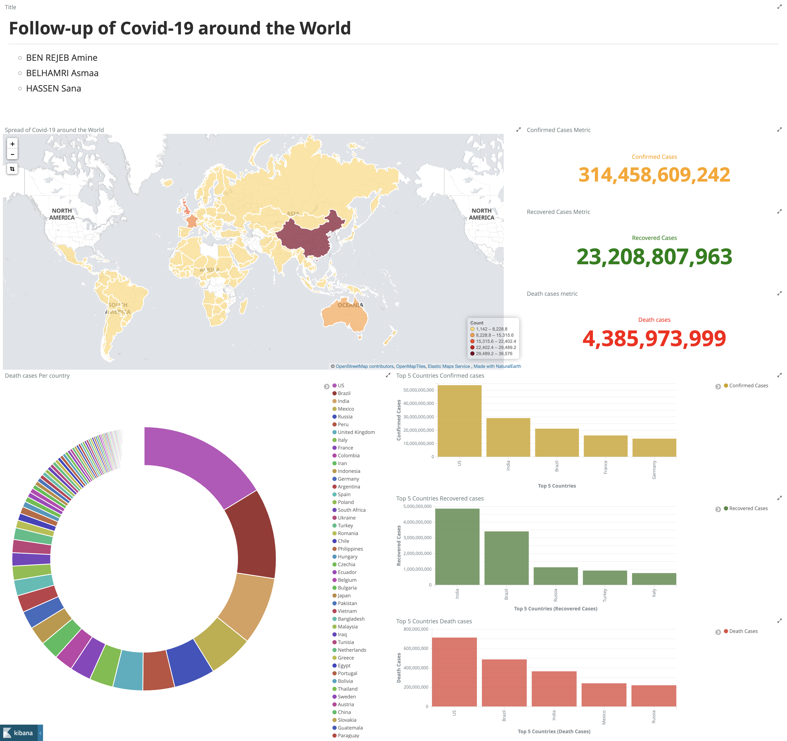

# Covid-19 tracker around the world

The project aims to provide an efficient solution for analyzing and visualizing data on covid-19 that can be found on [https://github.com/CSSEGISandData/COVID-19]. To achieve this, we're utilizing a technology stack that includes Elastic Search, Kibana, and Cassandra, all orchestrated using Docker Compose to implement the pipeline below:

## Prerequisites
    - Docker
    - Docker Compose

## Installation
    1- Clone the repository: git clone https://github.com/SanaHassen/Elastic-Search-Project.git
    2- Navigate to the project directory: cd src
    3- Build image and start containers: Start the containers: docker-compose up --build

> In our case, we chose to launch Cassandra, Elasticsearch and python at first place. Then, once python's job is successufly dones, we launch Kibana container to limit resource consumption.

## Usage 
After the containerized services are running, you can access the different services:

### Cassandra
You can access Cassandra at [localhost:9042]. You can use the cqlsh command-line tool to interact with the Cassandra database. After applying transformation on covid-19 data, it's stored in cassandra.

### Elasticsearch
You can access Elasticsearch at [http://localhost:9200]. You can use tools like curl or Postman to interact with the Elasticsearch API.
The image belows demontrates the indexation of coid-19 data in elasticsearch within the **covid** index.

### Kibana
You can access Kibana at [http://localhost:5601]. You can use Kibana to visualize and analyze your data in Elasticsearch. 
As an exmample, we created the dashboard below containing:
    - different metrics about confirmed, recovered and death case.
    - a map showing the spread of covid-19 in world countries.
    - charts and graphs.

## Configuration
You can customize the configuration of the application and the Elasticsearch, Kibana, and Cassandra containers by modifying the environment variables in the docker-compose.yml file.

## Acknowledgments
Thanks to the Docker, Elasticsearch, Kibana, and Cassandra communities for providing such great tools!

